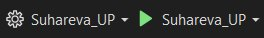
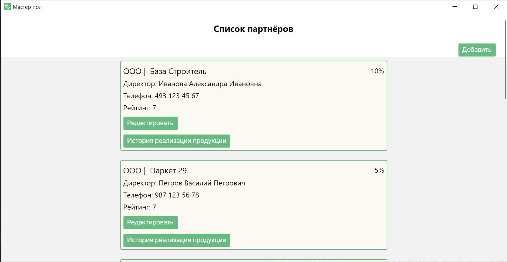
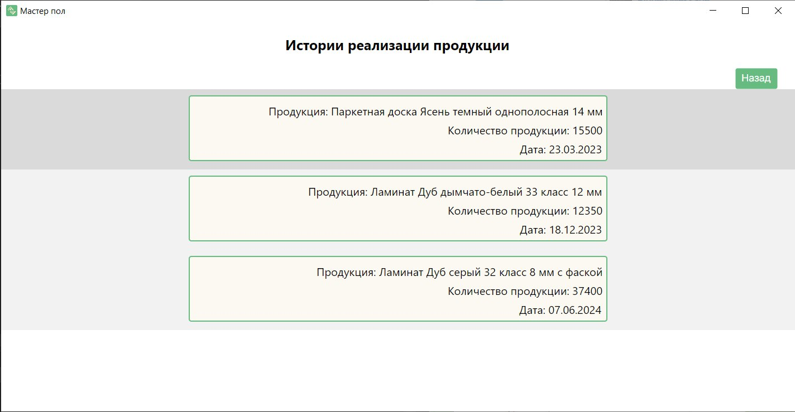
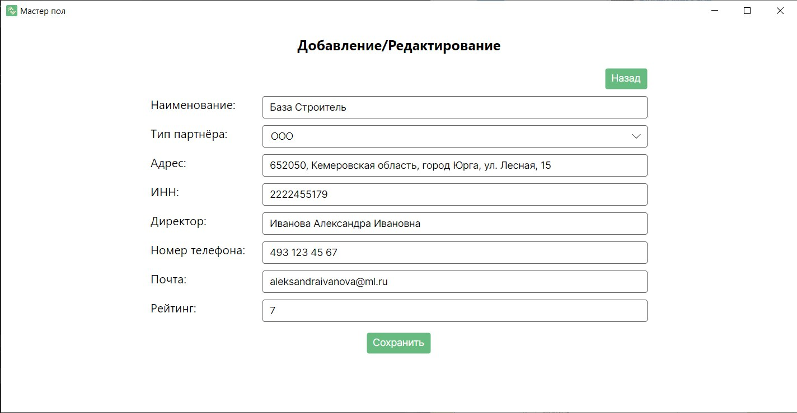
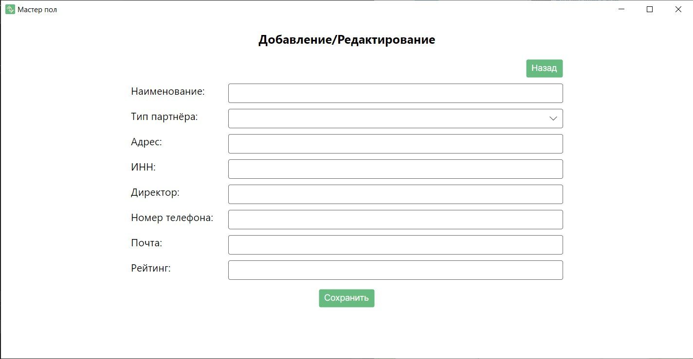

# Suhareva_UP

<h1 align="center">

 Мастер пол</h1>

## Описание

Данное программное решение предназначено для автоматизации учёта партнёров компании и истории их взаимодействий с продукцией.

В приложении можно найти следующие решения:
* Просмотр существующих партнёров компании;
* Изменение данных существующих партнёров;
* Добавление новых партнёров;
* Просмотр истории реализации продукции партнёрами.

Так же данная система включает в себя библиотеку для расчёта количества продукции.

## Начало работы

Эти инструкции предоставят вам копию проекта и помогут запустить на вашем локальном компьютере для разработки и тестирования.

## Необходимые условия

* Операционная система Windows 10 или выше
* Установленнная браузер (Google Chrome, Microsoft Edge или др.)
* Установленнная Visual Studio 2022
* Установленный .NET Framework 8.0 

## Установка
1. Перейти в [репозиторий проекта](https://github.com/AngieReee/Suhareva_UP);
2. Скопировать ссылку на проект;
3. Перейти в Visual Studio 2022 и склонировать проект с помощью ссылки;
4. Выбрать в качестве автозапускаемого элемента "Suhareva_UP";

5. Запустить проект.

## Инструкция
1. Главная страница
   
На данной странице пользователь может изучить список партнёров компании, а также:
* Перейти на страницу добавления нового партнёра по кнопке "Добавить"
* Перейти на страницу редактирования данных существующего партнёра по кнопке "Редактировать"
* Просмотреть историю реализации продукции партнёром по кнопке "История реализации продукции"

2. Страница истории реализации продукции партнёром
   
На данной странице пользователь может изучить систорию реализации продукции партнёром, а также:
* Вернуться на главную страницу по кнопке "Назад"

3. Страница редактирования данных партнёра
   
На данной странице пользователь может изменить данные уже существующего партнёра, а также:
* Вернуться на главную страницу по кнопке "Назад"

4. Страница добавления нового партнёра

На данной странице пользователь может добавить нового партнёра, а также:
* Вернуться на главную страницу по кнопке "Назад"

## Авторы
* **Сухарева Анжелика** - *разработчик проекта* - [Сухарева Анжелика](https://github.com/AngieReee)
